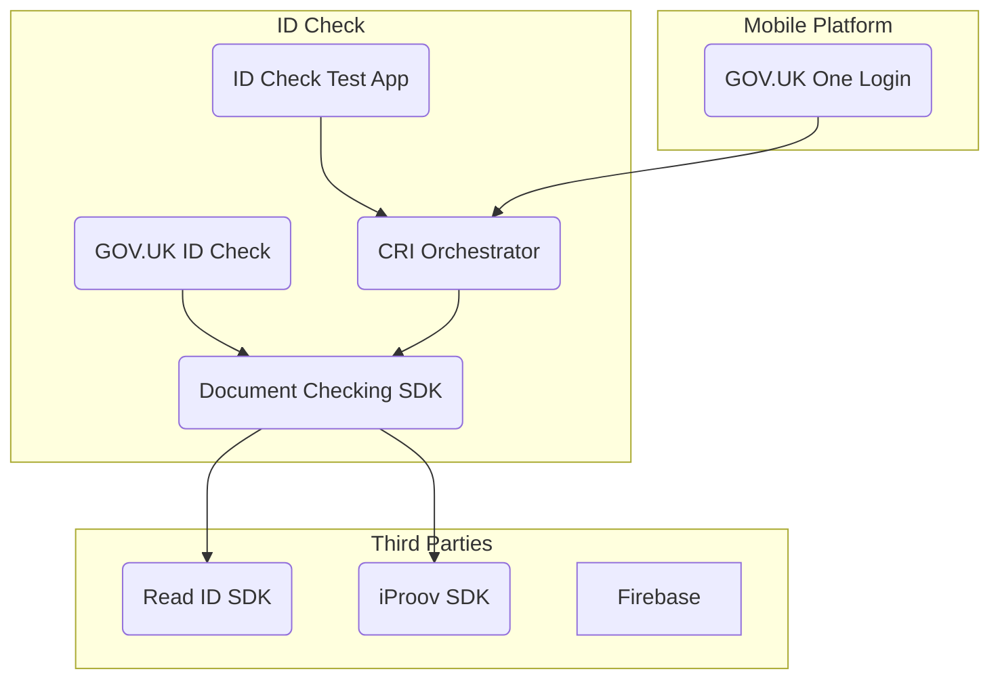

# mobile-android-cri-orchestrator

## About

The Credential Issuer (CRI) Orchestrator coordinates identity proofing functionality for the [GOV.UK One Login app](https://github.com/govuk-one-login/mobile-android-one-login-app).
It builds on the [ID Check SDK](https://github.com/govuk-one-login/mobile-id-check-android-sdk) used in the [GOV.UK ID Check app](https://github.com/govuk-one-login/mobile-id-check-android) with additional functionality including REST API based web-to-app handoff and document selection.

Currently the only CRI supported within the SDK is the [Document Checking CRI (DCMAW)](https://github.com/govuk-one-login/mobile-id-check-async), but this component could be extended in the future to allow for additional app-based CRIs.
In particular, adding support for the Address-Check and Fraud CRIs into the app would enable a complete end-to-end identity proofing journey within the GOV.UK One Login app.



See the [Mobile App Integration](https://github.com/govuk-one-login/architecture/blob/main/adr/0178-mobile-app-integration.md) ADR for more details.

## Getting Started

Clone the repository, including the Android pipelines submodule:
```bash
git clone --recurse-submodules git@github.com:govuk-one-login/mobile-android-cri-orchestrator.git
```
Learn more about working with [Git submodules](https://git-scm.com/book/en/v2/Git-Tools-Submodules).